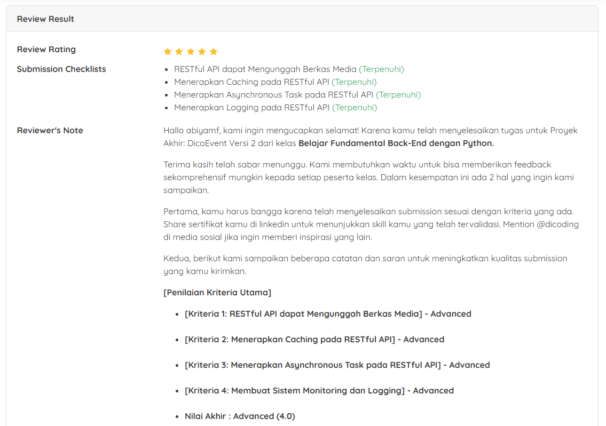

# Proyek Akhir: Dico Event 2
## Penilaian Proyek
Proyek ini berhasil mendapatkan bintang 5/5 pada submission dicoding course Belajar Fundamental Back-End Dengan Python.



# DicoEvent – Django RESTful API

Proyek ini adalah implementasi RESTful API menggunakan **Django REST Framework** untuk mengelola event, tiket, registrasi, dan pembayaran.
Dilengkapi dengan fitur autentikasi JWT, Role-Based Access Control (RBAC), upload media (MinIO), caching (Redis), asynchronous task (Celery + Mailtrap), dan logging (loguru).

---

## 🚀 Starter

```bash
# masuk ke environment
pipenv shell

# install dependencies
pipenv install django==4.2 djangorestframework psycopg2-binary python-dotenv
pipenv install celery redis loguru minio
```

Buat project:

```bash
django-admin startproject DicoEvent .
```

---

## 🗄️ Database Setup (PostgreSQL)

```sql
psql -U postgres
CREATE DATABASE dico_event;
GRANT ALL PRIVILEGES ON DATABASE "dico_event" TO developer;
ALTER DATABASE "dico_event" OWNER TO developer;
```

Tambahkan konfigurasi di `.env`:

```env
DATABASE_NAME=dico_event
DATABASE_USER=developer
DATABASE_PASSWORD=yourpassword
DATABASE_HOST=localhost
DATABASE_PORT=5432
```

---

## 🔑 Autentikasi & RBAC

* JWT Authentication (3 jam expiry).
* Role:

  * **Superuser** → full access.
  * **Admin** → CRUD Event, Ticket, Registration, Payment.
  * **Organizer** → CRUD Event miliknya.
  * **User** → daftar/login, lihat Event, beli Ticket, buat Registration, Payment.

---

## 🖼️ Upload Media (MinIO)

* Validasi file:

  * Max size: **500 KB**.
  * MIME type: **image/** only.
* Simpan metadata di tabel `Media`.
* File tersimpan di **MinIO**.
* Credential di `.env`:

```env
MINIO_ENDPOINT_URL=http://localhost:9000
MINIO_ACCESS_KEY=youraccesskey
MINIO_SECRET_KEY=yoursecretkey
```

Endpoint:

* `POST /api/events/upload/` → upload poster.
* `GET /api/events/{eventId}/poster/` → ambil semua poster untuk event.

---

## ⚡ Caching (Redis)

* Caching di endpoint:

  * `GET /api/events/{id}/` → detail event.
  * `GET /api/tickets/` → list tickets.
* Cache disimpan 1 jam.
* Header tambahan: `X-Data-Source: cache` bila data dari cache.
* Cache invalidated saat update/delete.
* Credential di `.env`:

```env
REDIS_HOST=localhost
```

---

## 📧 Asynchronous Task (Celery + Mailtrap)

* Celery dipakai untuk kirim email reminder **H-2 jam** sebelum event.
* Gunakan Mailtrap sebagai SMTP testing.

Konfigurasi `.env`:

```env
CELERY_BROKER_URL=redis://localhost:6379/0

MAIL_HOST=sandbox.smtp.mailtrap.io
MAIL_PORT=587
MAIL_USER=f39186826022c5
MAIL_PASSWORD=yourmailtrappassword
```

Jalankan worker:

```bash
celery -A DicoEvent worker -l info -P solo
```

---

## 📜 Logging (loguru)

* Semua log ada di folder `logs/`.
* `application.log` → level INFO.
* `error.log` → level ERROR.
* Format log:

  ```
  2025-06-08 14:41:43.260 | INFO     | reservations.views:post:31 - Registration ... created by user ...
  ```
* File rotation otomatis **setiap 1 hari**.

---

## 🧪 Pengujian

* Koleksi Postman: tersedia di folder `/postman`.
* Semua mandatory & optional test sudah dipenuhi.

---

## 💡 Tips

### Menjalankan Project

```bash
python manage.py runserver
```

### Jalankan Migration

```bash
python manage.py makemigrations
python manage.py migrate
```

### Buat Superuser

```bash
python manage.py createsuperuser
```

### Jalankan Celery

```bash
celery -A DicoEvent worker -l info -P solo
```

### Truncate Data (kecuali superuser)

```sql
TRUNCATE TABLE events_event, events_ticket, events_registration, events_payment, events_media RESTART IDENTITY CASCADE;
```

---

## 📌 Catatan

* Gunakan `-P solo` di Windows untuk menjalankan Celery (prefork hanya jalan di Linux/WSL/Docker).
* Untuk tes reminder, buat event dummy dengan `start_time = timezone.now() + timedelta(hours=2)` lalu jalankan task `send_event_reminders.delay()`.
